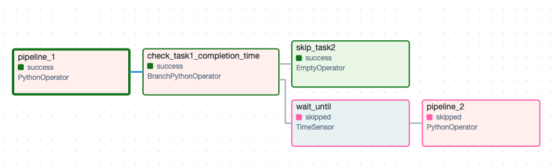

# premji-invest-assignment

This repo contains work for the take home assignment from premji invest. To start the Airflow DAG for running the pipelines, just modify the env variables in `startup.sh` and run:

```
$ bash startup.sh
```

Make sure that `docker` and `docker compose` is installed on the system.
## CI/CD

The repo has github workflows setup to check for linting errors in the code. The workflow runs on every PR to main branch.

## Mock APIs

I have implemented mock apis at `dummy_apis/` and set up a fastAPI server for them. There are 2 mock apis

* `get-senti-score/`: For getting sentiment value for a text
* `send-alert`: For sending alert messages on pipeline failures

## Evidence of working

This section includes screenshots/GIFs to demonstrate the working of the pipelines.

### Startup

On running the bash script, all the docker containers are started and we can access the Airflow WebUI at `localhost:8080` with username: `akshay` and password `premji123`.


### DAG graph

On the UI, we can see the DAG graph which shows all the DAG tasks and their dependencies.


We can see 4 tasks:

* `pipeline_1` which runs the first pipeline
* `check_task1_completion_time` which is a branch operator and decides whether to execute pipeline2 or skip it.
* `skip_task_2` a dummy task to avoid execution of pipeline2 in case pipeline 1 does not finish in time.
* `wait_time` a time sensor task which will keep running until the scheduled start time of pipeline2. This task makes sure that pipeline 2 does not start immediately after pipeline 1 finishes.
* `pipeline_2` which runs the second pipeline

### Screenshots

Following are the screenshots from a successful run of both pipelines.

#### Pipeline 1 logs


#### Scored persisted in database

```
$ cd dags
$ sqlite3 database.db
```

`select * from scores;`


#### Pipeline 2 logs


#### Graph in UI

We can see that the dummy task was skipped and pipeline 2 was executed


#### Graph when pipeline 1 does not finish in time

Here we see that the dag execution follows the branch of dummy task `skip_task2` and the run for pipeline 2 is skipped.



That's all Folks!


